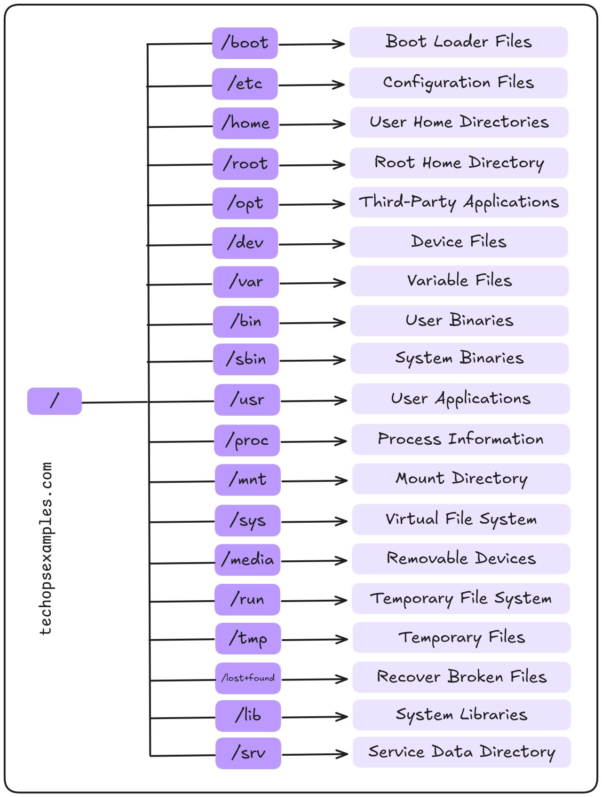

# Linux

## Linux File System Explained

## Soft Link and Hard Link
- Soft links are like shortcuts and can link to files across different filesystems, but they break if the original file is deleted.
- Hard links create another reference to the same data, remaining valid even if the original file is deleted, but they cannot link to directories or exist across different filesystems.

## Swap File

- Check swap file: `free -h`
- Show total, free and used swap space: `cat /proc/meminfo`
- Show active swap device: `cat /proc/swaps`
- Show swap info: `swapon --show`