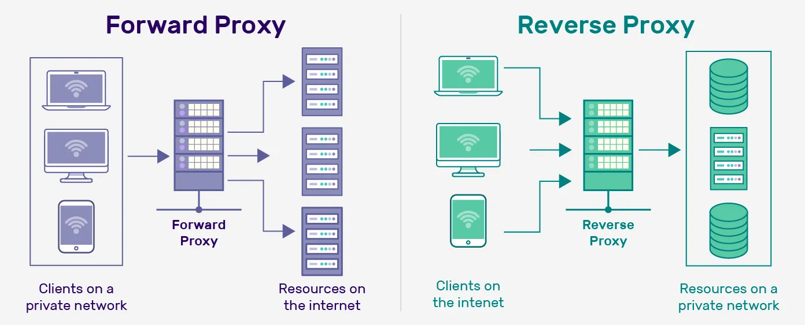

# Network

## HTTP

### HTTP Request Method

| Method | Description |
| ------ | ----------- |
| `GET`  | Used to request data. |
| `HEAD` | Requests the headers that would be returned. |
| `POST` | Send data to the server. |
| `PUT`  | Creates a new resource or replaces target resource with the request payload. |

### HTTP Status Code

| Method | Description |
| ------ | ----------- |
| `200 OK` | Success |
| `204 No Content` | The request was successfully processed, but there is no content. The headers may be useful. |
| `301 Moved Permanently` | Resource yas moved to new URL. |
| `304 Not Modified` | Used for caching purposes. The response hasn’t been modified. |
| `400 Bad Request` | Server won't process due to client error. |
| `401 Unauthorized` | The user doesn’t have valid authentication credentials to get the requested resource. |
| `403 Forbidden` | The client doesn’t have access rights to the content. |
| `404 Not found` | Cannot find the resource. |
| `405 Method Not Allowed` | Target resource doesn't support this method. |
| `500 Internal Server Error` | The server has encountered an unexpected error and cannot complete the request. |
| `502 Bad Gateway` | The server acts as a gateway and gets an invalid response from an inbound host. |
| `503 Service Unavailable` | The server is unable to process the request. This often occurs when a server is overloaded or down for maintenance.  |
| `504 Gateway Timeout` | he server was acting as a gateway or proxy and timed out, waiting for a response.  |

### Refrences

- [HTTP response status codes](https://developer.mozilla.org/en-US/docs/Web/HTTP/Status)

## Proxy vs Reversed Proxy

- **(Forward) Proxy** sit between user and Internet. Forward request on behalf of user. Use for caching, bypass restriction, enhance privacy.

- **Reversed Proxy** sit between Internet and server. Receive request on behalf of server. Use for caching, load balancing, SSL termination, protect server from direct exposure.

## Subnet mask calculation

- eg. For 10.0.0.10/20. How many usable hosts? What are the usable range?
- Full explanation: [Calculating the Range of IP Addresses from Subnet Mask](https://www.baeldung.com/cs/get-ip-range-from-subnet-mask)
- [IP Subnet Calculator](https://www.calculator.net/ip-subnet-calculator.html)

## OSI 7 layers

1. **Physical Layer**
    - Function: Transmits raw bit streams over a physical medium.
    - Examples: Cables, switches, hubs, and other hardware elements.
2. **Data Link Layer**
    - Function: Provides node-to-node data transfer, error detection and correction, and frame synchronization.
    - Examples: Ethernet, PPP (Point-to-Point Protocol), MAC addresses.
3. **Network Layer**
    - Function: Manages device addressing, tracks the location of devices on the network, and determines the best way to move data.
    - Examples: IP (Internet Protocol), routers.
4. **Transport Layer**
    - Function: Ensures complete data transfer, error recovery, and flow control. It segments and reassembles data for communications between end-to-end nodes.
    - Examples: TCP (Transmission Control Protocol), UDP (User Datagram Protocol).
5. **Session Layer**
    - Function: Manages sessions between applications, establishing, maintaining, and terminating connections.
    - Examples: NetBIOS, RPC (Remote Procedure Call).
6. **Presentation Layer**
    - Function: Translates, encrypts, and compresses data. It ensures that data is in a usable format and is presented to the application layer correctly.
    - Examples: SSL/TLS, JPEG, GIF.
7. **Application Layer**
    - Function: Provides network services directly to applications. It interfaces with software applications and provides services such as email, file transfer, and web browsing.
    - Examples: HTTP, FTP, SMTP.
8. Mnemonics: `Please Do Not Throw Sausage Pizza Away`

## What happen when a user connect to a e-commerce website?
1. User enter website URL.
2. Browser **resolve DNS domain name** to retrieve IP address.
3. Browser initialise **TCP connection**. Establish 3-way handshake.
4. Perform **SSL/TLS handshake** for HTTPS. Have certification verification, key exchange.
5. Browser send **HTTP GET request** to fetch homepage.
6. Browser **rendering web page**. Loading html, javascript, css, images.
7. User interact with the web page. Browsing product, cart which may trigger additional HTTPS request to server and restart process.
8. If there is require user login and authentication. User enter credential and send via **HTTPS POST** request.
9. Server then validate and **establish session** for user.

## TCP vs UDP
| Feature     | TCP | UDP |
| ----------- | --- | --- |
| Connection  | Connection-oriented Perform 3-way handshake | Connectionless |
| Reliability | Reliable Use acknowledgement, retransmission | Unreliable no acknowledgement |
| Header size | Bigger | Smaller |
| Speed       | Slower due overhead | Faster due minimal overhead |
| Use case    | Web browsing, email, file transfer | Streaming, gaming, broadcast |

## API Security Best Practise

1. Use HTTPS
2. Authentication, use OAuths
3. Rate limit
4. API Versioning
5. Allowlist
6. Check with OWASP API Security Risks
7. Use API Gateway
8. Error handling. Give descriptive helpful message
9. Input validation